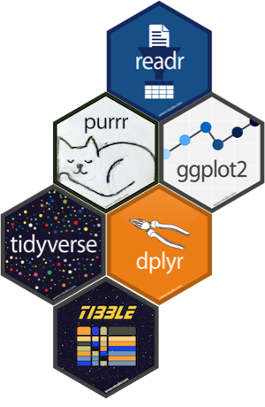
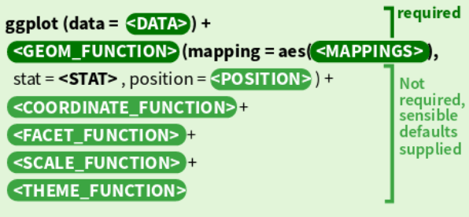

```{r setup, include=FALSE}
knitr::opts_chunk$set(echo = FALSE)
require(knitr)
require(kableExtra)
options(knitr.table.format = "html")
```

#Preamble

##R for data science


```{r out.width = "60%", fig.align = "center"}
knitr::include_graphics("images/cover.png")
```

*__R for data science__: The best place to start learning the tidyverse by Hadley Wickham and Garrett Grolemund (available online : https://r4ds.had.co.nz).
*__ggplot2: elegant graphics for data science__ by Hadley Wickham. Goes into greater depth into the ggplot2 visualisation system.


#Tidyverse & tidy data

##Tidyverse

__R packages for data science:__

```{r out.width = "100%", fig.align = "center"}

```

The tidyverse is an opinionated collection of R packages designed for data science. All packages share an underlying design philosophy, grammar, and data structures. (https://www.tidyverse.org/)

```{r, echo=T,eval=F}
install.packages("tidyverse")
```

## Tidyverse
\small
```{r, echo=T}
require(tidyverse)
```


## Tidy data

__Tidying:__ structuring datasets to facilitate analysis._

A tidy dataset :

```{r out.width = "40%", fig.align = "center"}
knitr::include_graphics("images/tidy-1.png")
```


## Why tidying a dataset ?

```{r define, echo=F, message=FALSE, warning=FALSE}
treatments <- 
    data.frame(
        treatment_a = sample(10:25,size = 3,replace = T),
        treatment_b = sample(10:25,size = 3,replace = T),
        treatment_c = sample(10:25,size = 3,replace = T)
    )
rownames(treatments) <- c("John Smith","Jane Doe","Mary Johnson")
```


```{r show1,results='asis'}
treatments %>% kable(caption = "Typical presentation dataset") %>%
  kable_styling(bootstrap_options = c("striped", "hover"))
```


```{r boxplot1, echo=TRUE, fig.height=4, fig.width=8}
boxplot(treatments)
```


## Why tidying a dataset ?

```{r,echo=T}
treatments.2 <- t(treatments)
```


```{r, echo=F,results='asis'}
kable(treatments.2,caption = "The same data but structured differently") %>%
  kable_styling(bootstrap_options = c("striped", "hover"))
```


```{r boxplot2, echo=TRUE, fig.height=3.8, fig.width=8}

boxplot(treatments.2)
```

## Why tidying a dataset ?

```{r}
treatments.3 <- tibble::rownames_to_column(treatments,var = "person")
treatments.3 <- tidyr::gather(treatments.3,key="treatment",value = "result",-person)
```


```{r echo=FALSE, message=FALSE, warning=FALSE,results='asis'}
treatments.3 %>% mutate(treatment = cell_spec(treatment, align = "c",background =factor(treatment,unique(treatments.3$treatment),RColorBrewer::brewer.pal(length(unique(treatments.3$treatment)), "Spectral")))) %>% mutate(person = cell_spec(person, align = "c",background =factor(person,unique(treatments.3$person),RColorBrewer::brewer.pal(length(unique(treatments.3$treatment)), "Set1")))) %>% 
    mutate(result = cell_spec(result, align = "c",background ="black",color = "white")) %>% kable(caption = "An exemple of a tidy dataset",escape=F) %>%
  kable_styling(bootstrap_options = c("striped", "hover"))
```


```{r boxplot3, echo=TRUE, fig.height=3, fig.width=8, message=FALSE, warning=FALSE}
boxplot(result~treatment,data=treatments.3)
```

## Why tidying a dataset ?

```{r boxplot4, echo=TRUE, fig.height=3, fig.width=8, message=FALSE, warning=FALSE}
boxplot(result~person,data=treatments.3)
```

```{r boxplot5, echo=TRUE, fig.height=3, fig.width=8, message=FALSE, warning=FALSE}
boxplot(result~person+treatment,data=treatments.3)
```

#Pipe and tibble

##Pipes

__The pipe %>%:__

* Come from the \textbf{magrittr} package by Stefan Milton Bache.
* Automatically loaded in tidyverse.
* Equivalent to `|` in `bash`

```{bash echo=TRUE}
cat iris.tsv | cut -f5 | sed 's/^./\U&/' | head
```

```{r echo=TRUE, message=FALSE, warning=FALSE}
read_tsv("iris.tsv",col_names = F) %>% pull(5) %>% str_to_title() %>% head
```

##Pipes vs no pipes : without pipe

```{r}
set.seed(123)
```

```{r histo1,echo=T, fig.height=3, fig.width=8}
ex.dat <- rnorm(n = 1000,mean = 5,sd=1)
sub.dat <- sample(ex.dat,size = 100,replace=F)
hist(sub.dat)
```

##Pipes vs no pipes : without pipe

```{r histo2,echo=T, fig.height=3, fig.width=8}
hist(sample(rnorm(n = 1000,mean = 5,sd=1),size = 100,replace=F))
```

##Pipes vs no pipes : with pipe

```{r histo3,echo=T, fig.height=3, fig.width=8}
rnorm(n = 1000,mean = 5,sd=1) %>%
    sample(size = 100,replace=F) %>%
    hist()
```


##Tibbles: `tibble::tibble`


```{r echo=TRUE, message=FALSE, warning=FALSE}
my.tibble <- tibble(
    person = c("John Smith","Jane Doe","Mary Johnson"),
    treatment_a = sample(10:25,size = 3,replace = T),
    treatment_b = sample(10:25,size = 3,replace = T),
    treatment_c = sample(10:25,size = 3,replace = T)
)
```

```{r}
my.tibble
```

##Tibbles: `tibble::tibble()`

__Pros: __

* Cells can contain list and data.frame.
* It never changes an input’s type (i.e., no more `stringsAsFactors = FALSE`!).
* Can use not valid R variable names (`:)`) as column names.
* Refined print method that shows only the first 10 rows.


__Cons: __

* It never uses `row.names()`.
    * use `tibble::rownames_to_column()`.


```{r echo=TRUE}
treatments %>% tibble::rownames_to_column("person") %>%
    as_tibble() %>%
    rename(`:)` = person)
```

##Split a dataset into multiples dataset using `tidyr::nest()`

```{r echo=TRUE}
my.tibble.split <- my.tibble %>% group_by(person) %>% nest(.key = Data)
my.tibble.split
```

```{r echo=TRUE}
my.tibble.split[["Data"]][[1]]
```

##Read/write tibbles: `readr::read_*` / `readr::write_*`
\Huge
__Read/write tibbles:__ :

* `readr::read_*`:

    * `read_csv`: comma delimited files.
    * `read_csv2`: semi-colon delimited files.
    * `read_tsv`: tab delimited files.
    * `read_delim`: any delimiter.
* `readr::write_*`:

    * `write_csv`: comma delimited files.
    * `write_csv2`: semi-colon delimited files.
    * `write_tsv`: tab delimited files.
    * `write_delim`: any delimiter.

##Read/write tibbles: `readr::read_*` / `readr::write_*`

```{r echo=TRUE}
read_tsv("iris.tsv",
         col_types = cols(
            Sepal.Length = col_double(),Sepal.Width = col_double(),
            Petal.Length = col_double(),Petal.Width = col_double(),
            Species = col_character()
         )
    )
```

#Tidying dataset

##Using `tidyr` to reshape data

Use `tidyr::gather()` and `tidyr::spread()` to reorganize the value.

```{r message=FALSE, warning=FALSE, include=FALSE}
treatment.3 <- treatments %>% tibble::rownames_to_column("person") %>%
    tidyr::gather(key="treatment",value = "result",-person)
```

```{r eval=F, echo = T}
treatments %>% tibble::rownames_to_column("person") %>%
    tidyr::gather(key="treatment",value = "result",-person)
```

```{r}
treatment.3
```

```{r echo=TRUE, message=FALSE, warning=FALSE}
treatment.3 %>% spread(key = "treatment",value = "result")
```

##Using `tidyr` to reshape data

```{r echo=TRUE, message=FALSE, warning=FALSE}
treatment.3 %>% separate(person,into = c("First Name","Last Name"),sep=" ")
```

#Manipulate a dataset using `dplyr`

##`dplyr`


__`dplyr`:__

* Manipulate variables.
* Manipulate observations.
* Group / summarise observations.

```{r}
iris.tbl <- iris %>% as_tibble()
```


```{r,results='asis'}

iris.tbl %>% head() %>% kable(caption="iris dataset") %>%
  kable_styling(bootstrap_options = c("striped", "hover"))

```


###iris dataset
The famous (Fisher’s or Anderson’s) iris data set gives the measurements in centimeters of the variables sepal length and width and petal length and width, respectively, for 50 flowers from each of 3 species of iris. The species are Iris setosa, versicolor, and virginica. (from ?iris)

##Manipulate __variables__ using `dplyr::select()`


```{r echo=TRUE, message=FALSE, warning=FALSE,eval=F}
iris.tbl %>% select(1:3)
iris.tbl %>% select(Sepal.Length,Sepal.Width,Petal.Length)
iris.tbl %>% select(Sepal.Length:Petal.Length)
iris.tbl %>% select(-Petal.Width,-Species)
```

```{r}
iris.tbl %>% select(1:3)
```

##Manipulate __variables__ using `dplyr::select()`

```{r echo=TRUE, message=FALSE, warning=FALSE}
iris.tbl %>% select(starts_with("Petal"))
```

##Manipulate __variables__ using `dplyr::pull()`

```{r echo=TRUE, message=FALSE, warning=FALSE,eval=F}
iris.tbl %>% select(Sepal.Length)
```

```{r}
iris.tbl %>% select(Sepal.Length) %>% print(n = 5, width = Inf)
```


```{r echo=TRUE, message=FALSE, warning=FALSE,eval=F}
iris.tbl %>% pull(Sepal.Length)
```

```{r}
iris.tbl %>% pull(Sepal.Length) %>% head(5)
```

##Modify  __variables__ using `dplyr::mutate()`


```{r echo=TRUE, message=FALSE, warning=FALSE}
iris.tbl %>%
    mutate(Petal.Length = 
               scales::percent(Petal.Length/max(Petal.Length))
           )
```

##Create __variables__ using `dplyr::mutate()`

```{r echo=TRUE, message=FALSE, warning=FALSE,eval=F}
iris.tbl %>%
    #Case 1
    mutate(Size = dplyr::case_when(
            Petal.Length >= 4 & Petal.Width >= 1.3 ~ "Big",
            Petal.Length < 4 & Petal.Width < 1.3 ~ "Small"
        )
    ) %>%
    #Case 2
    mutate(Ratio_Petal_Sepal_width = Petal.Width/Sepal.Width)
```

```{r echo=F, message=FALSE, warning=FALSE}
iris.tbl %>%
    mutate(Size = dplyr::case_when(
            Petal.Length >= 4 & Petal.Width >= 1.3 ~ "Big",
            Petal.Length < 4 & Petal.Width < 1.3 ~ "Small"
        )
    ) %>%
    mutate(Ratio_Petal_Sepal_width = Petal.Width/Sepal.Width) %>%
    select(Ratio_Petal_Sepal_width,Size,everything()) %>% slice(1:3)
```

other functions: 

* `dplyr::mutate_all()`: Apply a function to every columns.
* `dplyr::mutate_at()`: Apply a function to specific column.


##Arrange dataset using `dplyr::arrange()`

```{r echo=TRUE, message=FALSE, warning=FALSE}
iris.tbl %>% arrange(Petal.Length) %>% slice(1:5)
```

```{r,echo=T,eval=F}
iris.tbl %>% filter(min_rank(Petal.Length) <= 5)
iris.tbl %>% top_n(-5,Petal.Length) 
```

Use `desc()` to order by high to low.

##Manipulate __observations__ using `dplyr::filter()`

```{r echo=TRUE, message=FALSE, warning=FALSE}
iris.tbl %>% filter(Sepal.Length < 7) %>% slice(1:5)

iris.tbl %>% filter(Species ==  "setosa") %>% slice(1:5)
```

##Manipulate __observations__ using `dplyr::filter()`

```{r echo=TRUE, message=FALSE, warning=FALSE}
iris.tbl %>%
    filter(Sepal.Length < 7) %>%
    filter(Species ==  "setosa") %>% slice(1:5)


```

```{r,echo=T,eval=F}
iris.tbl %>%
    filter(Sepal.Length < 7 & Species ==  "setosa") %>% slice(1:5)

iris.tbl %>%
    filter(Sepal.Length < 7,Species ==  "setosa") %>% slice(1:5)
```

## __Summarise__ observations using `dplyr::summarise()`

```{r,echo=T}
iris.tbl %>% summarise(mean = mean(Petal.Length), sd = sd(Petal.Length))
iris.tbl %>% select(-Species) %>%summarise_all(mean)
iris.tbl %>% summarise(n = n())
```

## __Summarise__ observations using `dplyr::group_by()`

```{r,echo=T}
iris.tbl %>% group_by(Species) %>% summarise(mean = mean(Petal.Length), sd = sd(Petal.Length))
```


```{r,echo=T}
iris.tbl %>% group_by(Species) %>% summarise(n = n())
```

```{r,eval=F,echo=T}
iris.tbl %>% group_by(Species) %>% tally()
iris.tbl %>% count(Species)
```

## __Summarise__ observations using `dplyr::group_by()`

```{r,echo=T}
iris.tbl %>% group_by(Species) %>% filter(Petal.Length >= max(Petal.Length))
```

```{r,echo=T}
iris.tbl %>% group_by(Species) %>% top_n(1,Petal.Length)
```

##Mutating joins using `dplyr::*_join()`

```{r echo=TRUE}
iris.meta <- tibble(
    Species = factor(c("setosa","versicolor","virginica")),
    Colony = c("A","A","B") ,
    Ploidy = c("diploid","hexaploid","tetraploid"),
    `Common name` = c("Beachhead iris","Harlequin blueflag","Virginia iris")
)
```
```{r,results='asis'}
iris.meta %>% kable(caption = "Metadata for iris dataset") %>%
  kable_styling(bootstrap_options = c("striped", "hover"))
```


##Inner join

__Inner join:__ return all rows from `x` where there are matching values in `y`, and all columns from `x` and `y`. If there are multiple matches between `x` and `y`, all combination of the matches are returned.

```{r out.width = "40%", fig.align = "center"}
knitr::include_graphics("images/join-inner.png")
```
\small
```{r echo=TRUE}
iris.meta.nosetosa <- iris.meta %>% filter(Species !="setosa")
iris.tbl %>% inner_join(iris.meta.nosetosa,by = "Species") %>% print(n=5)
```


##Outer joins


* A __left join__ keeps all observations in `x`.
* A __right join__ keeps all observations in `y`.
* A __full join__ keeps all observations in `x` and `y`.


```{r out.width = "35%", fig.align = "center"}
knitr::include_graphics("images/join-outer.png")
```

##Left join

```{r}
iris.meta %>% kable(caption = "Metadata for iris dataset",booktabs = T) %>%kable_styling(bootstrap_options = c("striped", "hover")) %>% row_spec(1, strikeout = T)
```

__left join:__

```{r echo=TRUE}
iris.meta.nosetosa <- iris.meta %>% filter(Species !="setosa")
iris.tbl %>% left_join(iris.meta.nosetosa,by = "Species") %>% print(n=5)
```

##Right join

```{r}
iris.tbl %>% group_by(Species) %>%slice(1:2) %>% kable(caption = "iris dataset",booktabs = T) %>%kable_styling(bootstrap_options = c("striped", "hover")) %>% row_spec(1:2,strikeout = T)
```

__right join:__

```{r echo=TRUE}
iris.tbl.nosetosa <- iris.tbl %>% filter(Species !="setosa")
iris.tbl.nosetosa %>% right_join(iris.meta,by = "Species") %>% print(n=5)
```


##Outer joins
\small
__full join:__

```{r echo=TRUE,eval=F}
iris.meta.nosetosa <- iris.meta %>% filter(Species !="setosa")
iris.tbl %>% filter(Species != "virginica") %>% full_join(iris.meta.nosetosa,by = "Species")
```

```{r echo=F}
iris.tbl %>% filter(Species != "virginica") %>% full_join(iris.meta.nosetosa,by = "Species") %>% group_by(Species) %>% slice(1:5)
```

##Filtering joins


* __`semi_join(x, y)`__ keeps all observations in `x` that have a match in `y`.

```{r out.width = "40%", fig.align = "center"}
knitr::include_graphics("images/join-semi.png")
```

* __`anti_join(x, y)`__ drops all observations in `x` that have a match in `y`.

```{r out.width = "40%", fig.align = "center"}
knitr::include_graphics("images/join-anti.png")
```

##Filtering joins
```{r}
treatment.meta <- tibble(
    First_Name = c("John","Jane"),
    Last_Name = c("Smith","Doe"),
    age = sample(20:80,size = 2),
    sex = c("M","F"),
    adress = c("221B Baker Street","57 Rue de Varenne")
)
```

```{r echo=F, message=FALSE, warning=FALSE,results='asis'}

treatment.meta %>% kable(caption = "Patients files") %>%
  kable_styling(bootstrap_options = c("striped", "hover"))
```

```{r echo=TRUE}
treatments.3 %>%
    separate(person,into = c("First_Name","Last_Name"),sep=" ") %>%
    semi_join(treatment.meta,by = c("First_Name","Last_Name"))
```


##Use multiple command together

```{r}
test <- iris.tbl %>%
    gather(key = "Type",value = "obs",-Species) %>%
    separate(Type,into = c("Type_1","Type_2"),se="\\.") %>%
    group_by(Species,Type_1,Type_2) %>%
    mutate(med = median(obs)) %>%
    mutate(Size = ifelse(obs < med,"Small","Big")) %>%
    top_n(3,obs)
```

```{r message=FALSE, warning=FALSE,echo=T}
iris.tbl
```

##Use multiple command together

```{r message=FALSE, warning=FALSE,echo=T}
iris.tbl %>%
    gather(key = "Type",value = "obs",-Species) %>%
    separate(Type,into = c("Type_1","Type_2"),se="\\.")
```

##Use multiple command together

```{r message=FALSE, warning=FALSE,echo=T}
iris.tbl %>%
    gather(key = "Type",value = "obs",-Species) %>%
    separate(Type,into = c("Type_1","Type_2"),se="\\.") %>%
    group_by(Species,Type_1,Type_2) %>%
    mutate(med = median(obs))
```

##Use multiple command together
\small
```{r message=FALSE, warning=FALSE,echo=T}
iris.tbl %>%
    gather(key = "Type",value = "obs",-Species) %>%
    separate(Type,into = c("Type_1","Type_2"),se="\\.") %>%
    group_by(Species,Type_1,Type_2) %>%
    mutate(med = median(obs)) %>%
    mutate(Size = ifelse(obs < med,"Small","Big")) %>%
    left_join(iris.meta,by = "Species")
```

##Use multiple command together
\small
```{r message=FALSE, warning=FALSE,echo=T}
iris.tbl %>%
    gather(key = "Type",value = "obs",-Species) %>%
    separate(Type,into = c("Type_1","Type_2"),se="\\.") %>%
    group_by(Species,Type_1,Type_2) %>%
    mutate(med = median(obs)) %>%
    mutate(Size = ifelse(obs < med,"Small","Big")) %>%
    left_join(iris.meta,by = "Species") %>%
    arrange(desc(obs)) %>% slice(1)
```

#Data visualisation using `ggplot2`

##A base plot
\centering
```{r base_plot1,echo=TRUE, fig.height=6, fig.width=10, message=FALSE, warning=FALSE}
plot(Petal.Width~Petal.Length,data=iris.tbl)
```

##A ggplot2 plot
\centering
```{r ggplot1,echo=TRUE, fig.height=5, fig.width=10, message=FALSE, warning=FALSE}
iris.tbl %>% ggplot(aes(x=Petal.Width,y=Petal.Length)) +
    geom_point()
```

##A ggplot2 plot
\centering
```{r ggplot2,echo=TRUE, fig.height=5, fig.width=10, message=FALSE, warning=FALSE}
iris.tbl %>% ggplot(aes(x=Petal.Width,y=Petal.Length)) +
    geom_point() +
    geom_smooth(method = "lm")
```


##The three key components of every ggplot2
\Large

The three components of every graphics :

* __data__: the dataset who's need to be plotted.
* __aesthetics__: aesthetics mapping between variables in the data (x,y,visuals properties, ...).
* __geoms__: one or more layers to render each observations.

```{r out.width = "80%", fig.align = "center"}

```


##The three key components of every ggplot2
\Large

The three components of every graphics :

* __data__: the dataset who's need to be plotted.
* __aesthetics__: aesthetics mapping between variables in the data (x,y,visuals properties, ...).
* __geoms__: one or more layers to render each observations.

```{r ggplot3,echo=TRUE, fig.height=5, fig.width=10, message=FALSE, warning=FALSE,eval=F}
p <- iris.tbl %>%# Data
    ggplot(aes(x=Petal.Width,y=Petal.Length)) +# aesthetics
    geom_point()# Layer: points
```


Add layer : smooth with linear model

```{r ggplot4,echo=TRUE, fig.height=5, fig.width=10, message=FALSE, warning=FALSE,eval=F}
p + geom_smooth(method = "lm")
```

More you add components with `+`, more you'll build sophisticated plots.

##Add more aesthetics

```{r ggplot5,echo=TRUE, fig.height=5, fig.width=10, message=FALSE, warning=FALSE}
p <- iris.tbl %>%# Data
    ggplot(aes(x=Petal.Width,y=Petal.Length,col=Species)) +# aesthetics
    geom_point()# Layer: points
print(p)
```

##Add more aesthetics

```{r ggplot6,echo=TRUE, fig.height=5, fig.width=10, message=FALSE, warning=FALSE}
p + geom_smooth(method = "lm")
```

##Add more aesthetics

```{r ggplot7,echo=TRUE, fig.height=5, fig.width=10, message=FALSE, warning=FALSE}
p <- iris.tbl %>%# Data
    ggplot(aes(x=Petal.Width,y=Petal.Length)) +# aesthetics
    geom_point(aes(col=Species)) +# Layer: points
    geom_smooth(method = "lm")
print(p)
```

##Other aesthetics attributes

```{r ggplot8,echo=TRUE, fig.height=5, fig.width=10, message=FALSE, warning=FALSE}
p <- iris.tbl %>%# Data
    ggplot(aes(x=Petal.Width,y=Petal.Length)) +# aesthetics
    geom_point(aes(shape=Species))# Layer: points
print(p)
```


##Other aesthetics attributes

```{r ggplot9,echo=TRUE, fig.height=5, fig.width=10, message=FALSE, warning=FALSE}
p <- iris.tbl %>%# Data
    ggplot(aes(x=Petal.Width,y=Petal.Length)) +# aesthetics
    geom_point(aes(col=Species,size = Sepal.Length))# Layer: points
print(p)
```

##Use fixed value

```{r ggplot10,echo=TRUE, fig.height=5, fig.width=10, message=FALSE, warning=FALSE}
p <- iris.tbl %>%# Data
    ggplot(aes(x=Petal.Width,y=Petal.Length)) +# aesthetics
    geom_point(col="blue",size=4) +# Layer: points
    geom_smooth(method = "lm",col="red",fill="orange")
print(p)
```

##Plot geoms

```{r ggplot11,echo=F, fig.height=12, fig.width=22, message=FALSE, warning=FALSE}

p1 <- iris.tbl %>%# Data
    ggplot(aes(x=Species,y=Petal.Length)) +# aesthetics
    geom_violin(col = "#3c6382") + geom_boxplot(col = "#3c6382",width=0.1) + geom_jitter(col = "#3c6382") +  theme_minimal() + ggtitle("discrete x, continous y") + theme(plot.title = element_text(size = 20, face = "bold"))
p2 <- iris.tbl %>%# Data
    ggplot(aes(x=Petal.Width,y=Petal.Length,label = Species)) +# aesthetics
    geom_point(col = "#3c6382") +# Layer: points
    geom_smooth(method = "loess",col="#3c6382") + theme_minimal() + ggtitle("continous x, continous y")  + theme(plot.title = element_text(size = 20, face = "bold"))

p3 <- iris.tbl %>% select(Petal.Width,Species) %>% group_by(Species) %>% mutate(pos = 1:n()) %>% group_by(pos) %>% summarise(mean = mean(Petal.Width), sd = sd(Petal.Width)) %>% ggplot(aes(x=pos,y=mean)) + geom_line(col = "#3c6382") + geom_ribbon(aes(ymin = mean - sd, ymax = mean + sd),fill = "#3c6382",alpha=0.3) + theme_minimal() + ggtitle("continous x, continous y")  + theme(plot.title = element_text(size = 20, face = "bold"))

p4 <- iris.tbl %>% ggplot(aes(Petal.Length)) + geom_histogram(aes(y=..density..),fill = "#3c6382") + geom_density(aes(y=..density..))  + ggtitle("one variable continous")  + theme_minimal()+ theme(plot.title = element_text(size = 20, face = "bold"))

p5 <- iris.tbl %>%
    gather(key = "Type",value = "obs",-Species) %>% separate(Type,into = c("Type_1","Type_2"),se="\\.") %>% ggplot(aes(x=Type_1,y = obs)) + geom_bar(stat = "summary", fun.y = "mean",fill= "#3c6382",width=0.5) + facet_wrap(~Type_2,scale="free_y") + theme_minimal()  + ggtitle("discrete x, continous y") + theme(plot.title = element_text(size = 20, face = "bold"))

p6 <- iris.tbl %>% gather(key = "Type",value = "obs",-Species) %>% group_by(Species,Type) %>% mutate(individuals = 1:n()) %>% ggplot(aes(y=individuals,x=Type,fill=obs))+ geom_tile() + theme_minimal()  + ggtitle("discrete x, discrete y") + theme(plot.title = element_text(size = 20, face = "bold"),legend.position = "none") + scale_fill_gradient2(low = "#f5f6fa",high = "#3c6382")

cowplot::plot_grid(p1,p5,p6,p2,p3,p4)

```

##Facetting

__Facetting__: 

* `facet_grid(variable~foliaces)` : Display all possibility even if some plots are __empty__.
* `facet_wrap(variable~foliaces)` : Display only the plots having actual values.


```{r ggplot12,echo=F, fig.height=12, fig.width=22, message=FALSE, warning=FALSE}
iris.tbl %>%
    gather(key = "Type",value = "obs",-Species) %>% separate(Type,into = c("Type_1","Type_2"),se="\\.") %>% ggplot(aes(x=Species,y = obs,fill=Species)) + geom_boxplot(width=0.5) + facet_grid(Type_2~Type_1,scales = "free") + theme_grey(base_size = 30) + theme(legend.position = "none")
```


##Graphical options

```{r ggplot13,echo=TRUE, fig.height=5, fig.width=10, message=FALSE, warning=FALSE}
p <- iris.tbl %>%# Data
    ggplot(aes(x=Petal.Width,y=Petal.Length)) +# aesthetics
    geom_point(aes(col=Species,size = Sepal.Length)) +# Layer: points
    scale_color_brewer(palette="Set3") #A new palette
print(p)
```

##Graphical options

```{r ggplot14,echo=TRUE, fig.height=5, fig.width=10, message=FALSE, warning=FALSE}
p <- iris.tbl %>%# Data
    ggplot(aes(x=Petal.Width,y=Petal.Length)) +# aesthetics
    geom_point(aes(col=Species,size = Sepal.Length)) +# Layer: points
    scale_color_manual(values = c("red","blue","green"),  #A new palette
                       labels = c("Setosa","Versicolor","Virginica"))
print(p)
```

##Themes

```{r ggplot15,echo=F, fig.height=12, fig.width=22, message=FALSE, warning=FALSE}
p <- iris.tbl %>%# Data
    ggplot(aes(x=Petal.Width,y=Petal.Length)) +# aesthetics
    geom_point(aes(col=Species,size = Sepal.Length))#A new palette
p1 <- p + theme_grey(base_size = 22) + ggtitle("theme_grey") + theme(legend.position = "none") 

p2 <- p + theme_gray(base_size = 22)+ ggtitle("theme_gray") + theme(legend.position = "none") 

p3 <- p + theme_bw(base_size = 22)+ ggtitle("theme_bw") + theme(legend.position = "none") 

p4 <- p + theme_linedraw(base_size = 22)+ ggtitle("theme_linedraw") + theme(legend.position = "none") 

p5 <- p + theme_light(base_size = 22)+ ggtitle("theme_light") + theme(legend.position = "none") 

p6 <- p + theme_dark(base_size = 22)+ ggtitle("theme_dark") + theme(legend.position = "none") 

p7 <- p + theme_minimal(base_size = 22)+ ggtitle("theme_minimal") + theme(legend.position = "none") 

p8 <- p + theme_classic(base_size = 22)+ ggtitle("theme_classic") + theme(legend.position = "none") 

p9 <- p + theme_void(base_size = 22)+ ggtitle("theme_void") + theme(legend.position = "none") 

p10 <- p + theme_test(base_size = 22)+ ggtitle("theme_test") + theme(legend.position = "none") 

cowplot::plot_grid(p1,p2,p3,p4,p5,p6,p7,p8,p9,p10)

```

##Themes

```{r ggplot16,echo=F, fig.height=12, fig.width=22, message=FALSE, warning=FALSE}
p <- iris.tbl %>%
    gather(key = "Type",value = "obs",-Species) %>% separate(Type,into = c("Type_1","Type_2"),se="\\.") %>% ggplot(aes(x=Species,y = obs,fill=Species)) + geom_boxplot(width=0.5) + facet_grid(Type_2~Type_1,scales = "free")
p1 <- p + theme_grey(base_size = 22) + ggtitle("theme_grey") + theme(legend.position = "none") 

p2 <- p + theme_gray(base_size = 22)+ ggtitle("theme_gray") + theme(legend.position = "none") 

p3 <- p + theme_bw(base_size = 22)+ ggtitle("theme_bw") + theme(legend.position = "none") 

p4 <- p + theme_linedraw(base_size = 22)+ ggtitle("theme_linedraw") + theme(legend.position = "none") 

p5 <- p + theme_light(base_size = 22)+ ggtitle("theme_light") + theme(legend.position = "none") 

p6 <- p + theme_dark(base_size = 22)+ ggtitle("theme_dark") + theme(legend.position = "none") 

p7 <- p + theme_minimal(base_size = 22)+ ggtitle("theme_minimal") + theme(legend.position = "none") 

p8 <- p + theme_classic(base_size = 22)+ ggtitle("theme_classic") + theme(legend.position = "none") 

p9 <- p + theme_void(base_size = 22)+ ggtitle("theme_void") + theme(legend.position = "none") 

p10 <- p + theme_test(base_size = 22)+ ggtitle("theme_test") + theme(legend.position = "none") 

cowplot::plot_grid(p1,p2,p3,p4,p5,p6,p7,p8,p9,p10)

```


##Themes

```{r ggplot17,echo=F, fig.height=12, fig.width=22, message=FALSE, warning=FALSE}
p <- iris.tbl %>%
    gather(key = "Type",value = "obs",-Species) %>% separate(Type,into = c("Type_1","Type_2"),se="\\.") %>% ggplot(aes(x=Species,y = obs,fill=Species)) + geom_boxplot(width=0.5) + facet_grid(Type_2~Type_1,scales = "free") + ggtitle("Iris dataset")

p1 <-iris.tbl %>%
    gather(key = "Type",value = "obs",-Species) %>% separate(Type,into = c("Type_1","Type_2"),se="\\.") %>% ggplot(aes(x=Species,y = obs,fill=Species)) + geom_boxplot(width=0.5,col="#dfe6e9") + facet_grid(Type_2~Type_1,scales = "free") + ggtitle("Iris dataset") + theme_minimal(base_size=18) + theme(text = element_text(family="Helvetica",face="bold"),legend.key = element_rect(fill = "#f1f2f6", colour = "#3c6382",linetype="dotted"), 

plot.title = element_text(size = rel(1.5),colour = "#2f3542",hjust = 0.5), 
strip.background = element_rect(fill = "#636e72", colour = "#2d3436"), 
panel.background = element_rect(fill = "#2d3436", colour = "#2d3436"), 
strip.text = element_text(colour = "#dfe6e9"),
panel.border = element_blank(), 
panel.grid.major = element_line(colour = "#f5f6fa",linetype = "dashed",size = 0.3), 
panel.grid.minor = element_line(colour = "#f5f6fa", size = 0.25,linetype = "dotted"),
legend.position = "bottom",legend.key.size =  unit(0.3, "in"),legend.text = element_text(size=rel(1.2)),legend.title = element_text(size=rel(1.2))) + ggsci::scale_fill_tron() 

cowplot::plot_grid(p,p1)

```

##Extensions
\Large

* __ggplot2__ extensions: This site tracks and lists ggplot2 extensions developed by R users in the community. [https://www.ggplot2-exts.org/](https://www.ggplot2-exts.org/).
* __cowplot__: Arranging graphs into a grid and improve plot design.
* __ggpubr & ggstatsplot__: Publication ready plots \& add statistical tests.
* __ggrepel__: Automatic label placement.
* __esquisse__: Explore and Visualize Your Data Interactively with ggplot2.
* __ggvis__: Create rich interactive graphics with a syntax similar in spirit to ggplot2.


##Why I use `ggplot2`
\Large

* The "default" output is much nicer than with base graphics.
* Automatic legend, color with mapping to the variables.
* Easy to combine multiple plot.
* Easy facetting.
* A lot of themes.
* A lot of extensions ...

#Sources

##Sources

\Large

__Sources:__

* __PDF and sources:__ [https://github.com/rochevin/tidyverse_journal_club](https://github.com/rochevin/tidyverse_journal_club)
* __Web version:__ [https://rochevin.github.io/tidyverse_journal_club](https://rochevin.github.io/tidyverse_journal_club)